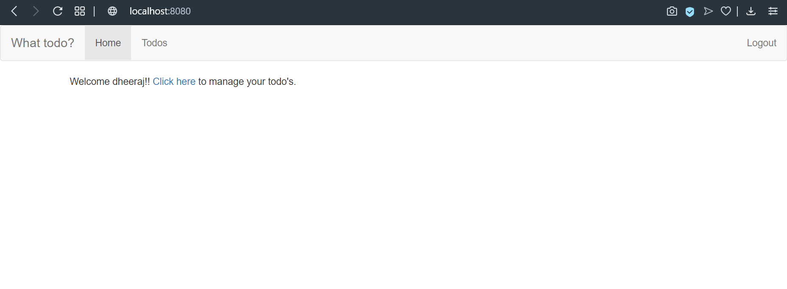
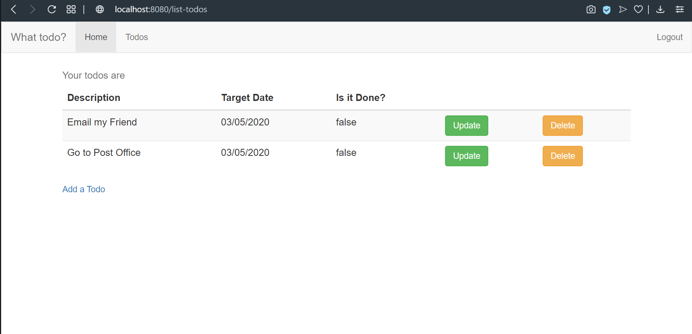

# SpringBoot_Todo_Application

This application maintains the todo list for the user.

It has update and delete options in the list.

Spring security has also been added to make it more secure.

  
  
